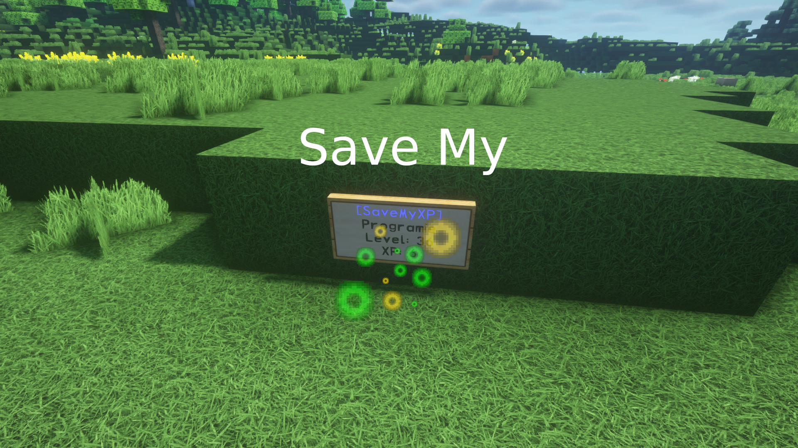

# SaveMyXP

A Minecraft Bukkit plugin to save your XP by using a sign.

## What is it?

Did you ever reach the moment where you have too many XP on your player and wanted to just keep them somewhere save before losing them in the Nether?

Then this plugin is the right one for you! It allows you to place an unlimited amount of signs securely storing your XPs by just hitting it with your empty hand.

## Installation

You can get the latest release from [GitLab](https://gitlab.com/Programie/SaveMyXP/pipelines?scope=tags).

## Permissions

The following permission nodes are available:

* `savemyxp.create` - Allow creating (and using) your own XP signs (Default: everyone)
* `savemyxp.destroy-any` - Allow to destroy any XP signs (not just your own) (Default: op)
* `savemyxp.*` - Allow access to all features (Default: op)

## Commands

There are no commands.

## How to use it?

Just create a sign with the text `[SaveMyXP]` on the first line.

Once successfully placing the sign, your player name will appear on the second line.

Now just hit the sign with your empty hand (i.e. do not carry a block or tool), and it will transfer your XP to the sign.

To retrieve the XP from the sign again, just interact with the sign (i.e. right click on it).

You may also sneak while hitting the sign or interact with it to transfer only the configured amount to the sign or withdraw the whole XP from it.

## Build

You can build the project in the following 2 steps:

* Check out the repository
* Build the jar file using maven: *mvn clean package*

**Note:** JDK 1.8 and Maven is required to build the project!